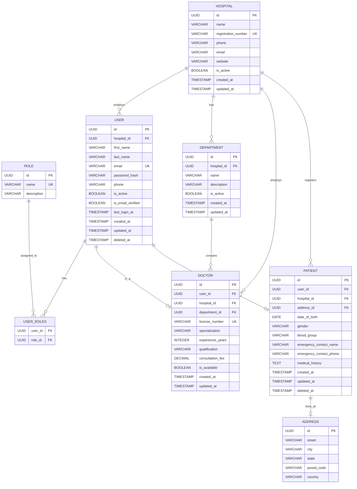

# MedCore HMS — Database ER Diagram

> **Scope (Day 1):** Hospital, User, Role, Department, Doctor, Patient, Address
> Multi-tenancy: all tenant-scoped entities carry a `hospital_id` FK.

---

## Entity Relationship Diagram



---

## Table Descriptions

### `hospital`
The root tenant entity. Every hospital in the system is isolated by its `id`. SUPER_ADMIN can see all hospitals; all other roles are scoped to one hospital.

### `address`
Standalone address entity — reusable. Currently linked to `patient` (1:1) but designed to be attached to `hospital` and `doctor` in future iterations.

### `role`
Pre-seeded with 9 roles (see architecture.md). No hospital scoping — roles are global definitions.

### `user`
Core identity entity. All humans in the system are users first. `hospital_id` enforces tenant isolation. Soft-deleted via `deleted_at`.

### `user_roles` (join table)
Many-to-many between `user` and `role`. A user can have multiple roles (e.g., a DOCTOR who is also a DEPARTMENT_HEAD).

### `department`
Hospital-scoped grouping of doctors (e.g., Cardiology, Orthopedics). Belongs to one hospital.

### `doctor`
Extends `user` via 1:1 `user_id` FK. Stores professional info (license, specialization, fee). Belongs to a department.

### `patient`
Extends `user` via 1:1 `user_id` FK. Stores medical info. Has one address. Soft-deletable.

---

## Key Design Decisions

| Decision | Rationale |
|----------|-----------|
| UUID PKs everywhere | Prevents sequential ID enumeration attacks |
| `hospital_id` on all tenant tables | Single-schema multi-tenancy — simple joins, easy SUPER_ADMIN reporting |
| Soft delete (`deleted_at`) | Medical records must be retained for compliance |
| `user` → `doctor`/`patient` via 1:1 | Single login for any role; user switches between doctor/patient profiles |
| `user_roles` join table | Users can hold multiple roles simultaneously |

---

## Indexes (to be added in migration)

```sql
-- Performance indexes
CREATE INDEX idx_user_hospital_id ON "user"(hospital_id);
CREATE INDEX idx_user_email ON "user"(email);
CREATE INDEX idx_doctor_hospital_id ON doctor(hospital_id);
CREATE INDEX idx_doctor_department_id ON doctor(department_id);
CREATE INDEX idx_patient_hospital_id ON patient(hospital_id);
CREATE INDEX idx_department_hospital_id ON department(hospital_id);

-- Partial index for soft deletes
CREATE INDEX idx_user_active ON "user"(hospital_id) WHERE deleted_at IS NULL;
CREATE INDEX idx_patient_active ON patient(hospital_id) WHERE deleted_at IS NULL;
```
